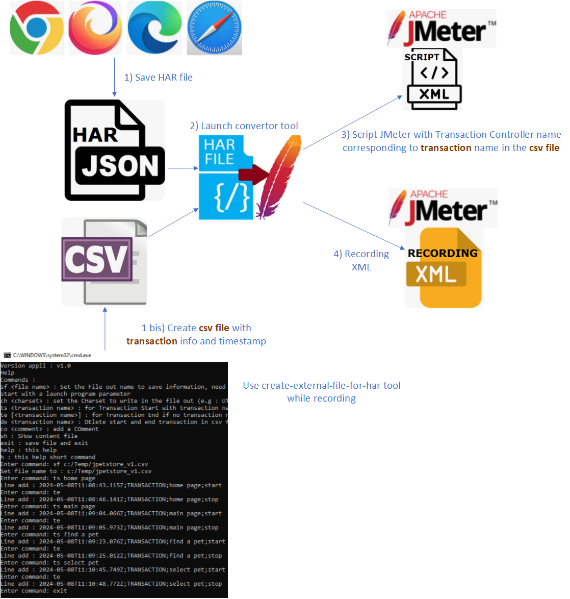
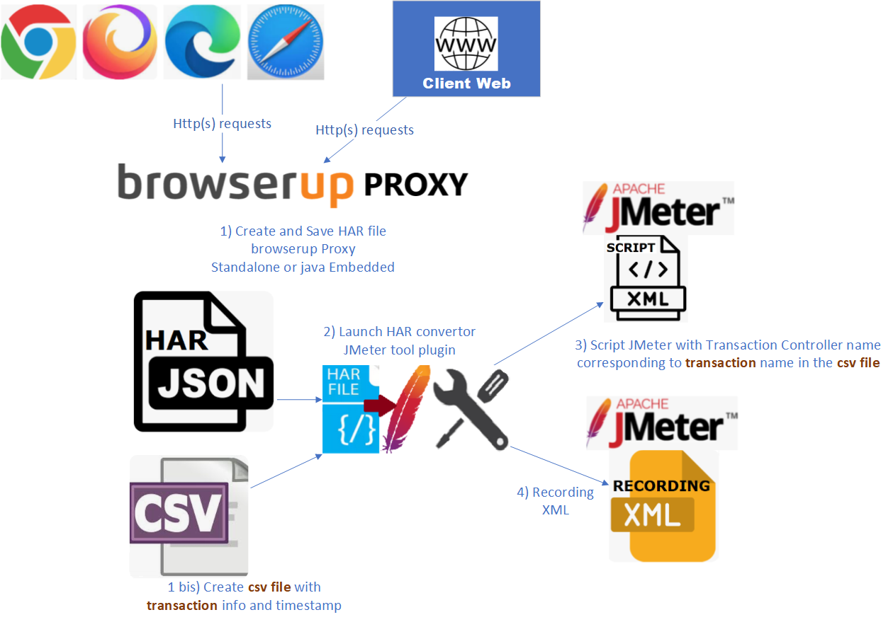
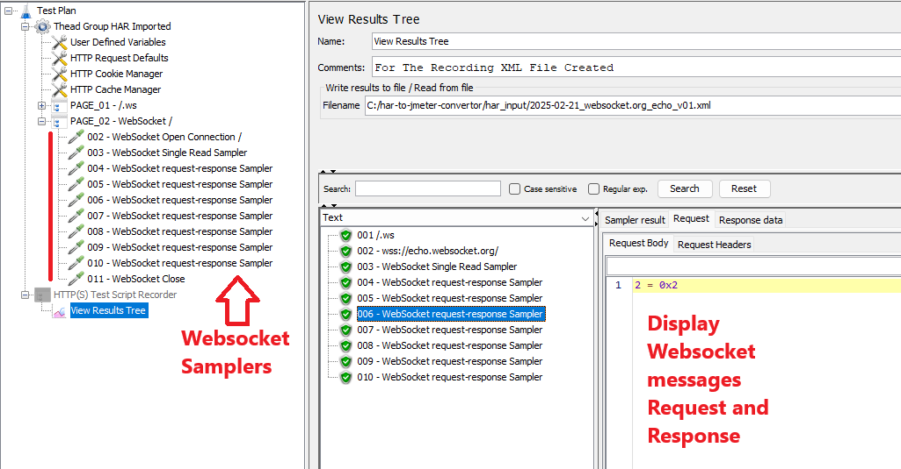

<p align="center">


  <p align="center">Convert a HAR file to a JMeter script and a Record XML file.</p>
  <p align="center"><a href="https://github.com/vdaburon/har-to-jmeter-convertor">Link to github project har-to-jmeter-convertor</a></p>
</p>

# har-to-jmeter-convertor
# Convert a HAR file to a JMeter script and a Record XML file.

An article about motivations to create this tool: https://dzone.com/articles/convert-a-har-file-to-jmeter-script

## Creating a har file and run the tool har-to-jmx-convertor to simulate recording from the JMeter recording template
This tool har-to-jmx-convertor try to **simulate** a script JMeter and a record xml file recording from the **JMeter recording template**.

Since version 7.0, **Websocket** is manage with samplers from the plugin "WebSocket Samplers by Peter Doornbosch".

### JMeter recording template and HTTP(S) Test Script Recorder - The standard way to record
This demonstration use the web site from : https://petstore.octoperf.com

The JMeter recording template : <br/>


The result of recording with JMeter "HTTP(S) Test Script Recorder" : <br/>


### HAR created on a Browser (e.g. Firefox) - The new way with the convertor tool
Record the navigation in the web application with Developper tool : **Network** and **save** exchanges in **HAR** file format : <br/>


Launch the "Convertor tool" : <br/>


Tool results : Open the script created and the record.xml in a View Results Tree <br/>


### HAR created in Chrome Browser with the LoadRunner Web Recorder Chrome Extension
This tool is compatible with Har file generated with the LoadRunner Web Recorder Chrome Extension.

The main advantage is to declare **Transaction Names when recording** and navigate to the web site. This transactions will be Page Names (Transaction Controllers names) in the JMeter script.


The LoadRunner Web Recorder Chrome Extension is available at this url : <br/>
[Download the Recorder extension for Chrome : "HarGeneratorChrome"](https://www.microfocus.com/marketplace/appdelivery/content/recorder-extension-for-chrome)

You need to add the parameter and value : <code>-use_lrwr_infos transaction_name</code> to indicate that is a HAR file generated with LoadRunner Web Recorder (lrwr).


### Standard HAR file created with Firefox, Chrome, Edge with external csv file for transaction information
You could add an external file that contains information about transaction name start and end.



The CSV format is :
- <code>Timestamp iso format GMT;TRANSACTION;transaction name;start</code> for starting a new transaction
- <code>Timestamp iso format GMT;TRANSACTION;transaction name;stop</code> for ending transaction the precedent transaction
- Separator ";"
- Charset UTF-8

E.g :
<pre>
2024-05-06T12:39:58.711Z;TRANSACTION;login;start
2024-05-06T12:40:08.643Z;TRANSACTION;login;stop
2024-05-06T12:40:20.880Z;TRANSACTION;home;start
2024-05-06T12:40:37.634Z;TRANSACTION;home;stop
</pre>

A simple tool named "create-external-file-for-har" create easily this csv file. https://github.com/vdaburon/create-external-file-for-har

You need to add the parameter and value : <code>-external_file_infos c:/Temp/jpetstore.csv</code> to set the csv file to read

### HAR created with BrowserUp Proxy
This tool is compatible with Har file generated with BrowserUp Proxy.

The BrowserUp Proxy create a har and could filter url or content (no binary).

The proxy client could be a browser or a client http in an application.

BrowserUp Proxy could be embedded in a java application or in Selenium java code application.



The BrowserUp Proxy **active** project is available at this url : <br/>
[Goto the BrowserUp Proxy active project](https://github.com/valfirst/browserup-proxy)

Note : The BrowserMod Proxy tool is no more active (since september 2017) and it's recommended to migrate to BrowerUp proxy https://github.com/valfirst/browserup-proxy the "valfirst" GitHub username/project is important.

## Websocket use the plugin "WebSocket Samplers by Peter Doornbosch"
If your Har file contains WebSocket Connection and Messages, set the parameter <code>-ws_with_pdoornbosch true</code>, this tool will try to create Websocket Samplers in the JMeter script generated and the exchanges in the Recording XML file.

Documentation at : https://bitbucket.org/pjtr/jmeter-websocket-samplers/src/master/

The HAR is record from **Chrome** Browser not Firefox Browser and not Egde Browser (research in har file the attribute : '_webSocketMessages').

Currently limitation to only one websocket connection and multi text messages (send or receive) in this websocket connection (binary message is not tested).

Text message could be on "STOMP" format (https://en.wikipedia.org/wiki/Streaming_Text_Oriented_Messaging_Protocol) or no "STOMP" (simple text).

Need the plugin "WebSocket Samplers by Peter Doornbosch" to open the generated script that contain Websocket Samplers.

This demonstration use the web site : https://websocket.org/tools/websocket-echo-server/




## Parameters
Parameters are :
* har_in the HAR file to read (exported HAR from Web Browser :  Chrome, Firefox, Edge ...)
* jmx_out the file JMeter script generated
* record_out create the record xml file from the har file (could be open with the Listener View Results Tree) <br/>
  e.g. record_out = record.xml
* add_result_tree_record, add a View Result Tree to view the Recording XML File Generated (default true), the record_out must be not empty
* filter_include, the regular expression matches the URL to Include (first filter) <br/>
    * default all = empty (no filter)
    * e.g. filter_include=https://mysite.com/.*
* filter_exclude, the regular expression matches the URL to Exclude (second filter) <br/>
    * default all = empty (no filter)
    * e.g. filter_exclude=https://notmysite.com/.*
    * or filter statics, filter_exclude=(?i).*\\.(bmp|css|js|gif|ico|jpe?g|png|swf|eot|otf|ttf|mp4|woff|woff2|svg)
* add_pause boolean, use with parameter  new_tc_pause (default true), add Flow Control Action Pause
* new_tc_pause time between 2 urls to create a new page (Transaction Controller) <br/>
    * e.g. 5000 for 5 sec between 2 urls
* remove_cookie, remove header with cookie because use a Cookie Manager (default true)
* remove_cache_request, remove request cache header because use a Cache Manager (default true)
* page_start_number, set the start page number for partial recording (default 1, must be an integer > 0)
* sampler_start_number, set the start sampler number for partial recording (default 1, must be an integer > 0)
* use_lrwr_infos, the har file has been generated with LoadRunner Web Recorder Chrome extension and contains Transaction Name, expected values : 'transaction_name' or don't add this parameter
* external_file_infos, external csv file contains information about Timestamp, Transaction Name, date start or end.
* ws_with_pdoornbosch boolean, manage websocket messages with the JMeter plugin from Peter DOORNBOSH (default false), if true need the plugin 'WebSocket Samplers by Peter Doornbosch' to open the generated script.

## Command line tool (CLI)
This tool could be use with script shell Windows or Linux.

Help to see all parameters :

<pre>
C:\apache-jmeter\bin&gt;java -jar har-to-jmeter-convertor-7.0-jar-with-dependencies.jar -help

INFOS: Start main
usage: io.github.vdaburon.jmeter.har.HarForJMeter [-add_pause &lt;add_pause&gt;] [-add_result_tree_record
       &lt;add_result_tree_record&gt;] [-external_file_infos &lt;external_file_infos&gt;] [-filter_exclude &lt;filter_exclude&gt;]
       [-filter_include &lt;filter_include&gt;] -har_in &lt;har_in&gt; [-help] -jmx_out &lt;jmx_out&gt; [-new_tc_pause &lt;new_tc_pause&gt;]
       [-page_start_number &lt;page_start_number&gt;] [-record_out &lt;record_out&gt;] [-remove_cache_request
       &lt;remove_cache_request&gt;] [-remove_cookie &lt;remove_cookie&gt;] [-sampler_start_number &lt;sampler_start_number&gt;]
       [-use_lrwr_infos &lt;use_lrwr_infos&gt;] [-ws_with_pdoornbosch &lt;ws_with_pdoornbosch&gt;]
io.github.vdaburon.jmeter.har.HarForJMeter
 -add_pause &lt;add_pause&gt;                             Optional boolean, add Flow Control Action Pause after Transaction
                                                    Controller (default true)
 -add_result_tree_record &lt;add_result_tree_record&gt;   Optional boolean, add 'View Result Tree' to view the record.xml file
                                                    created (default true), record_out must be not empty
 -external_file_infos &lt;external_file_infos&gt;         Optional, csv file contains external infos : timestamp transaction
                                                    name and start or end
 -filter_exclude &lt;filter_exclude&gt;                   Optional, regular expression to exclude url
 -filter_include &lt;filter_include&gt;                   Optional, regular expression to include url
 -har_in &lt;har_in&gt;                                   Har file to read (e.g : my_file.har)
 -help                                              Help and show parameters
 -jmx_out &lt;jmx_out&gt;                                 JMeter file created to write (e.g : script.jmx)
 -new_tc_pause &lt;new_tc_pause&gt;                       Optional, create new Transaction Controller after request ms, same
                                                    as jmeter property : proxy.pause, need to be &gt; 0 if set. Usefully
                                                    for Har created by Firefox or Single Page Application (Angular,
                                                    ReactJS, VuesJS ...)
 -page_start_number &lt;page_start_number&gt;             Optional, the start page number for partial recording (default 1)
 -record_out &lt;record_out&gt;                           Optional, file xml contains exchanges likes recorded by JMeter
 -remove_cache_request &lt;remove_cache_request&gt;       Optional boolean, remove cache header in the http request (default
                                                    true because add a Cache Manager)
 -remove_cookie &lt;remove_cookie&gt;                     Optional boolean, remove cookie in http header (default true because
                                                    add a Cookie Manager)
 -sampler_start_number &lt;sampler_start_number&gt;       Optional, the start sampler number for partial recording (default 1)
 -use_lrwr_infos &lt;use_lrwr_infos&gt;                   Optional, the har file has been generated with LoadRunner Web
                                                    Recorder and contains Transaction Name, expected value :
                                                    'transaction_name' or don't add this parameter
 -ws_with_pdoornbosch &lt;ws_with_pdoornbosch&gt;         Optional boolean, Manage websocket messages with the JMeter plugin
                                                    from Peter DOORNBOSH (default false), if true need the plugin from
                                                    Peter DOORNBOSH to open the generated script
E.g : java -jar har-for-jmeter-&lt;version&gt;-jar-with-dependencies.jar -har_in myhar.har -jmx_out scriptout.jmx -record_out
recording.xml -add_result_tree_record true -new_tc_pause 5000 -add_pause true -filter_include "https://mysite/.*"
-filter_exclude "https://notmysite/*" -page_start_number 50 -sampler_start_number 250 -ws_with_pdoornbosch false

</pre>


<pre>
C:\apache-jmeter\bin>java -jar har-to-jmeter-convertor-7.0-jar-with-dependencies.jar -har_in "myhar.har" -jmx_out "script_out.jmx" -filter_include "https://mysite.com/.*" -filter_exclude "https://notmysite.com/.*" -add_pause true -new_tc_pause 5000
</pre>

<pre>
/var/opt/apache-jmeter/bin>java -jar har-to-jmeter-convertor-7.0-jar-with-dependencies.jar -har_in "myhar.har" -jmx_out "script_out.jmx" -record_out "record.xml" -add_pause true -new_tc_pause 5000
</pre>

## Usage Maven
The maven groupId, artifactId and version, this plugin is in the **Maven Central Repository** [](https://maven-badges.herokuapp.com/maven-central/io.github.vdaburon/har-to-jmeter-convertorr)

```xml
<groupId>io.github.vdaburon</groupId>
<artifactId>har-to-jmeter-convertor</artifactId>
<version>7.0</version>
```

## License
Licensed under the Apache License, Version 2.0

## Versions
Version 7.0 date 2025-02-27, Manage the websocket messages with 'WebSocket Samplers by Peter Doornbosch', add new boolean parameter 'ws_with_pdoornbosch' (default false).

Version 6.1 date 2025-01-28, correct a NullPointerException when creating the Recording XML file

Version 6.0 date 2024-09-19, add 'HTTP(S) Test Script Recorder' and 'View Results Tree' to view the Record.xml file created. Correct save file no url encoded name.

Version 5.3 date 2024-09-13, correct PUT with no parameter, no content and mime-type ==  null

Version 5.2 date 2024-06-20, correct extract parameters for mime type "form-urlencoded" ended with charset likes "application/x-www-form-urlencoded; charset=xxx"

Version 5.1 date 2024-05-15, compatible with har generated by browsermob-proxy tool (https://github.com/lightbody/browsermob-proxy) and csv external_file_infos contains transaction infos.

Version 5.0 date 2024-05-10, add an external csv file with transaction information for JMeter Transaction Controller Name. New parameter : <code>-external_file_infos transaction_infos.csv</code>. Correct Filter Include first filter and Filter Exclude second filter.

Version 4.0 date 2024-05-06, could read har file generated with the LoadRunner Web Recorder Chrome Extension that contains transaction name for JMeter Transaction Controller Name. New parameter <code>-use_lrwr_infos transaction_name</code>

Version 2.3 date 2024-03-30, encode value for x-www-form-urlencoded when value contains space ' ' or equal '=' or slash '/' or plus '+' characters. Correct add the content for body data for POST, PUT or PATCH if not x-www-form-urlencoded in the Record.xml file.

Version 2.2 date 2024-03-29, remove the header 'Content-length' because the length is computed by JMeter when the request is created. POST or PUT could have query string and body with content so add query string to the path. Set Content Encoding to UFT-8 for POST or PUT method and request Content-Type : application/json. Add body data content in Record.xml for PUT and PATCH methods.

Version 2.1 date 2024-03-13, change the version in the code and the comment for the test plan. Use the extension to find is response is text or bin.

Version 2.0 date 2024-03-12, for POST multipart/form-data don't put the content of the file in the Record.xml file because binary content could be large and not XML compatible, add parameters : page_start_number and sampler_start_number to facilitate partial recording of website navigation.

Version 1.0 date 2024-03-11, First Release.
