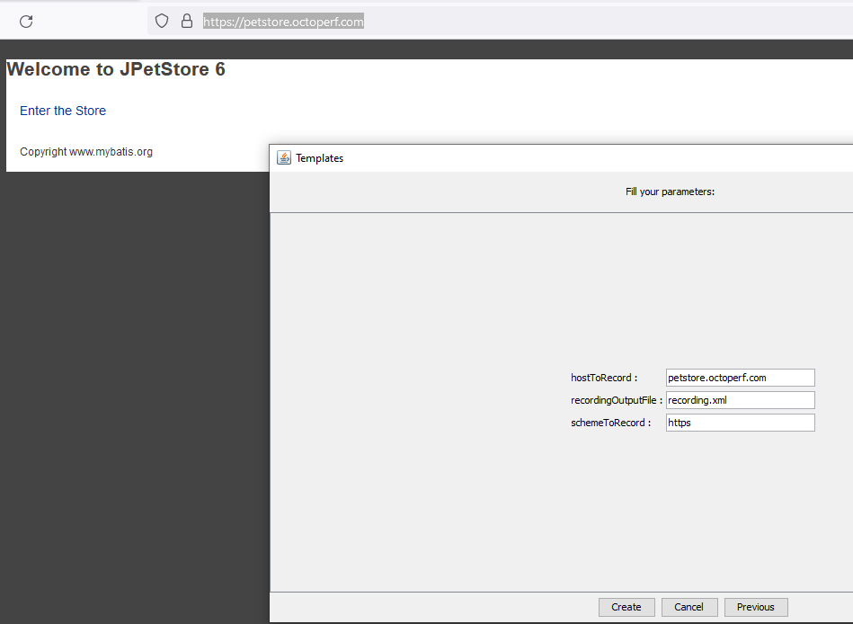
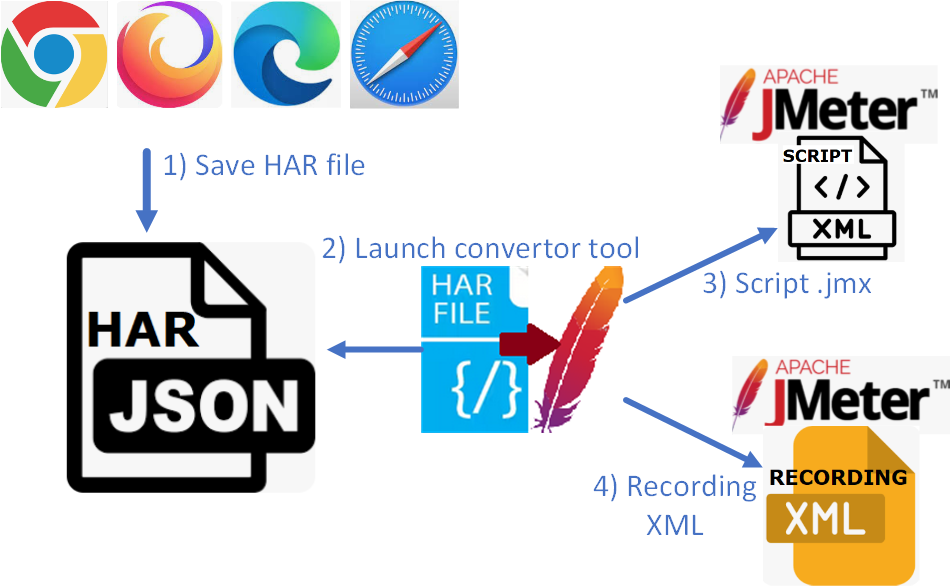
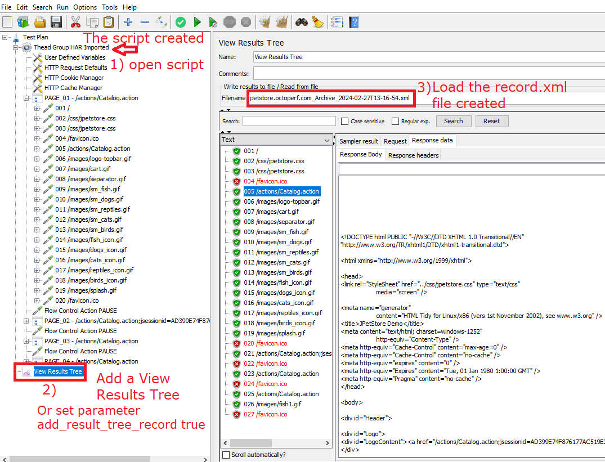

<p align="center">


  <p align="center">Convert a HAR file to a JMeter script and a Record XML file.</p>
  <p align="center"><a href="https://github.com/vdaburon/har-to-jmeter-convertor">Link to github project har-to-jmeter-convertor</a></p>
</p>

# har-to-jmeter-convertor
# Convert a HAR file to a JMeter script and a Record XML file.

## Creating a har file and run the tool har-to-jmx-convertor to simulate recording from the JMeter recording template
This tool har-to-jmx-convertor try to **simulate** a script JMeter and a record xml file recording from the **JMeter recording template**.

### JMeter recording template and HTTP(S) Test Script Recorder - The standard way to record
The JMeter recording template : <br/>


The result of recording with JMeter "HTTP(S) Test Script Recorder" : <br/>


### HAR created on a Browser (e.g. Firefox) - The new way with the convertor tool
Record the navigation in the web application with Developper tool : **Network** and **save** exchanges in **HAR** file format : <br/>


Launch the "Convertor tool" : <br/>


Tool results : Open the script created and the record.xml in a View Results Tree <br/>


## Parameters
Parameters are :
* har_in the HAR file to read (exported HAR from Web Browser :  Chrome, Firefox, Edge ...)
* jmx_out the file JMeter script generated
* record_out create the record xml file from the har file (could be open with the Listener View Results Tree) <br/>
  e.g. record_out = record.xml
* filter_include,  the regular expression matches the URL to Include <br/>
    * default all = empty (no filter)
    * e.g. filter_include = https://mysite.com/.*
* filter_exclude,  the regular expression matches the URL to Exclude <br/>
    * default all = empty (no filter)
    * e.g. filter_exclude = https://notmysite.com/.*
* add_pause boolean, use with parameter  new_tc_pause (default true), add Flow Control Action Pause
* new_tc_pause time between 2 urls to create a new page (Transaction Controller) <br/>
    * e.g. 5000 for 5 sec between 2 urls
* remove_cookie, remove header with cookie because use a Cookie Manager (default true)
* remove_cache_request, remove request cache header because use a Cache Manager (default true)


## Command line tool (CLI)
This tool could be use with script shell Windows or Linux.

Help to see all parameters :

<pre>
C:\apache-jmeter\bin&gt;java -jar har-to-jmeter-convertor-1.0-jar-with-dependencies.jar -help

usage: io.github.vdaburon.jmeter.har.HarForJMeter [-add_pause &lt;add_pause&gt;] [-filter_exclude &lt;filter_exclude&gt;]
       [-filter_include &lt;filter_include&gt;] -har_in &lt;har_in&gt; [-help] -jmx_out &lt;jmx_out&gt; [-new_tc_pause &lt;new_tc_pause&gt;]
       [-record_out &lt;record_out&gt;] [-remove_cache_request &lt;remove_cache_request&gt;] [-remove_cookie &lt;remove_cookie&gt;]
io.github.vdaburon.jmeter.har.HarForJMeter
 -add_pause &lt;add_pause&gt;                         Optional boolean, add Flow Control Action Pause after Transaction
                                                Controller (default true)
 -filter_exclude &lt;filter_exclude&gt;               Optional, regular expression to exclude url
 -filter_include &lt;filter_include&gt;               Optional, regular expression to include url
 -har_in &lt;har_in&gt;                               Har file to read (e.g : my_file.har)
 -help                                          Help and show parameters
 -jmx_out &lt;jmx_out&gt;                             JMeter file created to write (e.g : script.jmx)
 -new_tc_pause &lt;new_tc_pause&gt;                   Optional, create new Transaction Controller after request ms, same as
                                                jmeter property : proxy.pause, need to be &gt; 0 if set. Usefully for Har
                                                created by Firefox or Single Page Application (Angular, ReactJS, VuesJS
                                                ...)
 -record_out &lt;record_out&gt;                       Optional, file xml contains exchanges likes recorded by JMeter
 -remove_cache_request &lt;remove_cache_request&gt;   Optional boolean, remove cache header in the http request (default true
                                                because add a Cache Manager)
 -remove_cookie &lt;remove_cookie&gt;                 Optional boolean, remove cookie in http header (default true because add
                                                a Cookie Manager)
E.g : java -jar har-for-jmeter-&lt;version&gt;-jar-with-dependencies.jar -har_in myhar.har -jmx_out scriptout.jmx
-new_tc_pause 5000 -add_pause true -filter_include "https://mysite/.*" -filter_exclude "https://notmysite/*"
</pre>


<pre>
C:\apache-jmeter\bin>java -jar har-to-jmeter-convertor-1.0-jar-with-dependencies.jar -har_in "myhar.har" -jmx_out "script_out.jmx" -filter_include "https://mysite.com/.*" -filter_exclude "https://notmysite.com/.*" -add_pause true -new_tc_pause 5000
</pre>

<pre>
/var/opt/apache-jmeter/bin>java -jar har-to-jmeter-convertor-1.0-jar-with-dependencies.jar -har_in "myhar.har" -jmx_out "script_out.jmx" -record_out "record.xml" -add_pause true -new_tc_pause 5000
</pre>

## Usage Maven
The maven groupId, artifactId and version, this plugin is in the **Maven Central Repository** [](https://maven-badges.herokuapp.com/maven-central/io.github.vdaburon/har-to-jmeter-convertorr)

```xml
<groupId>io.github.vdaburon</groupId>
<artifactId>har-to-jmeter-convertor</artifactId>
<version>1.0</version>
```
## Versions
version 1.0 date 2024-03-11, First Release
